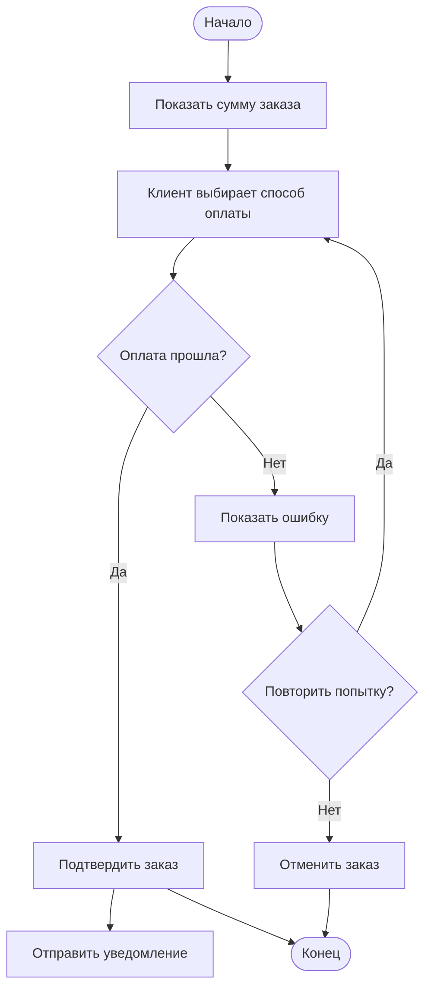

# Flowchart: Проверка оплаты заказа

```mermaid
flowchart TD
    A([Начало]) --> B[Показать сумму заказа]
    B --> C[Клиент выбирает способ оплаты]
    C --> D{Оплата прошла?}
    D -- Да --> E[Подтвердить заказ]
    D -- Нет --> F[Показать ошибку]
    F --> G{Повторить попытку?}
    G -- Да --> C
    G -- Нет --> H[Отменить заказ]
    E --> J[Отправить уведомление]
    E --> I([Конец])
    H --> I
```
