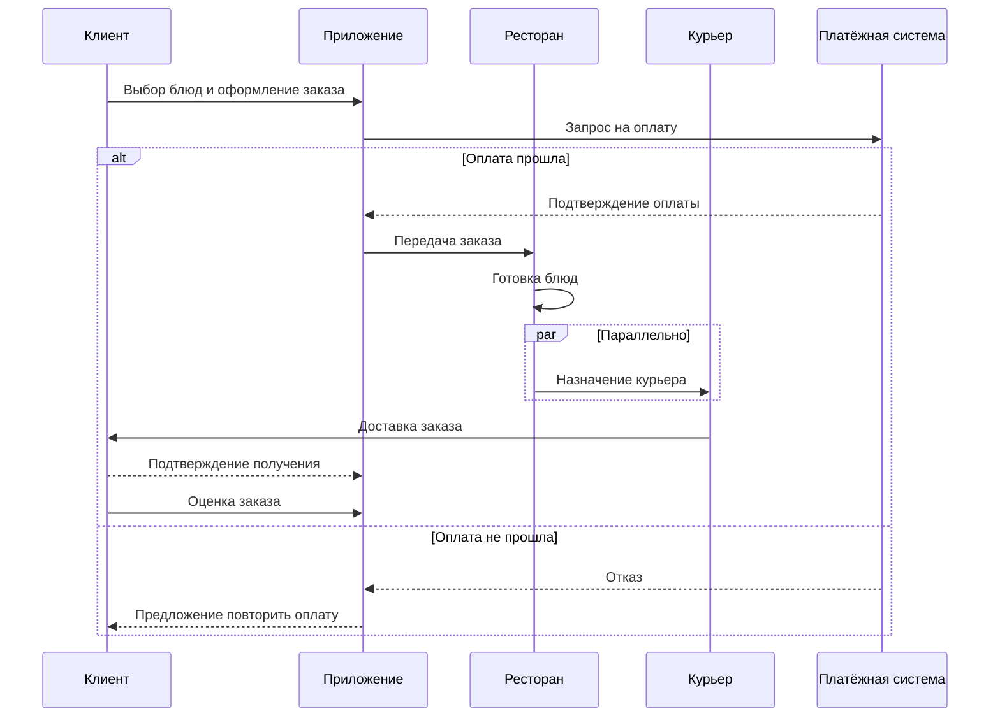

# Sequence Diagram: Заказ еды с доставкой

```mermaid
sequenceDiagram
    participant K as Клиент
    participant P as Приложение
    participant R as Ресторан
    participant C as Курьер
    participant S as Платёжная система

    K->>P: Выбор блюд и оформление заказа
    P->>S: Запрос на оплату
    alt Оплата прошла
        S-->>P: Подтверждение оплаты
        P->>R: Передача заказа
        R->>R: Готовка блюд
        par Параллельно
            R->>C: Назначение курьера
        end
        C->>K: Доставка заказа
        K-->>P: Подтверждение получения
        K->>P: Оценка заказа
    else Оплата не прошла
        S-->>P: Отказ
        P-->>K: Предложение повторить оплату
    end

```
