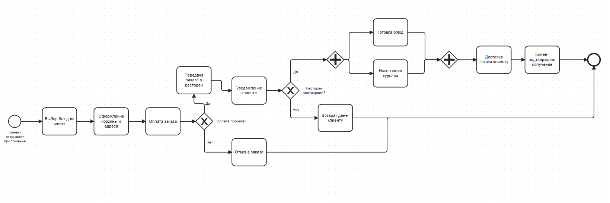
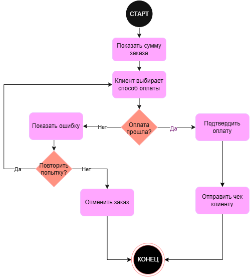
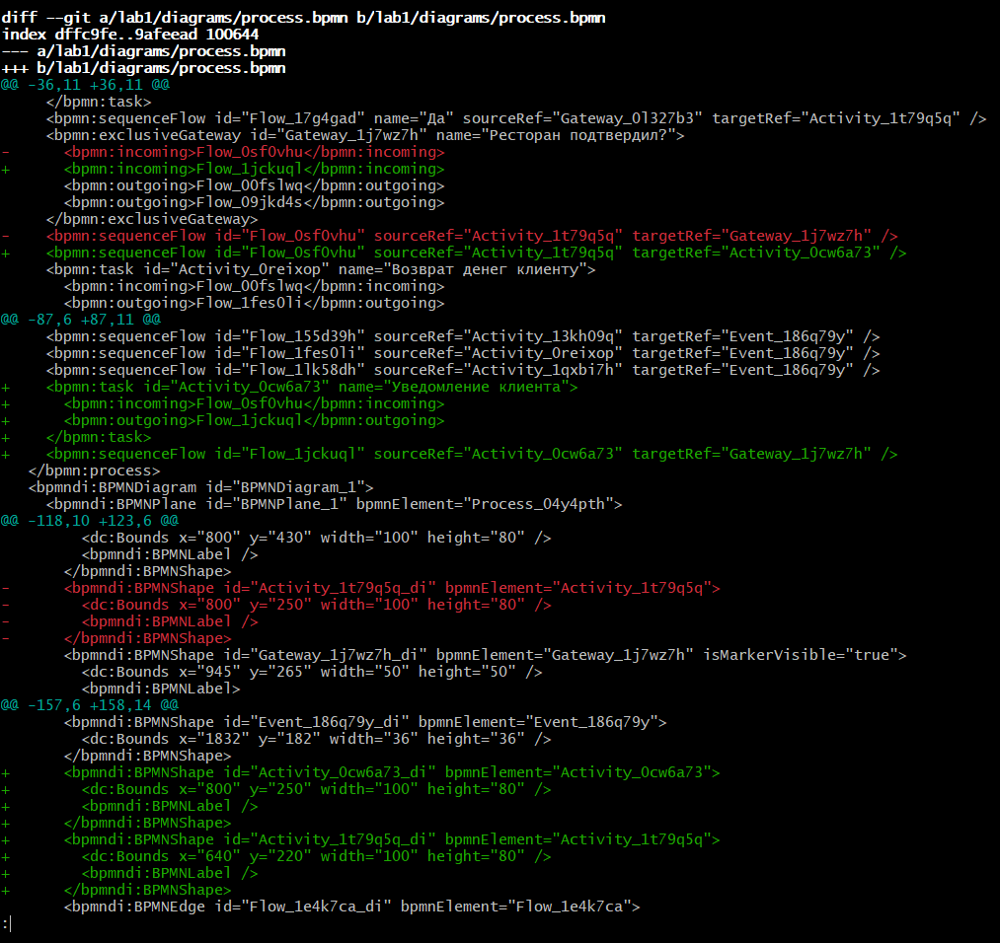
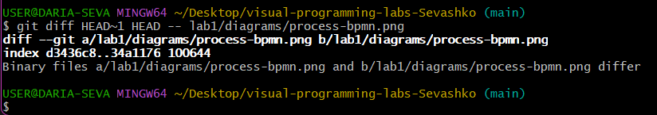
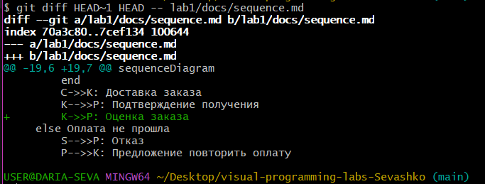
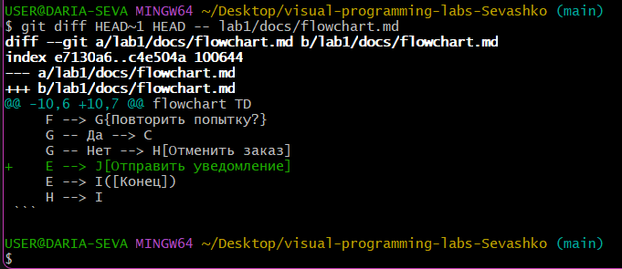
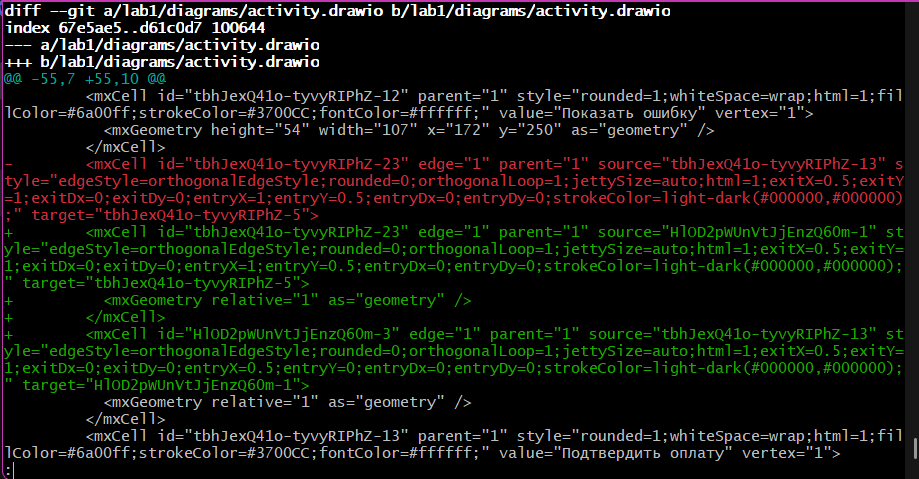
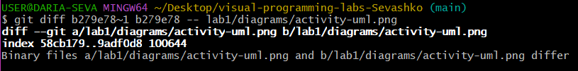

Отчёт по лабораторной работе №1

Мой процесс

Я выбрала процесс «Заказ еды в ресторане с доставкой». В нём участвуют
клиент, приложение, ресторан, курьер и платёжная система. Клиент выбирает блюда, оплачивает заказ, ресторан готовит, курьер доставляет. Есть две точки ветвления: оплата может не пройти, а ресторан может не подтвердить заказ. Также есть параллельные действия — пока повар готовит, система назначает курьера.

Диаграммы

BPMN

UML Activity

Sequence Diagram (Mermaid)
См. файл [sequence.md](docs/sequence.md)

Flowchart (Mermaid)
См. файл [flowchart.md](docs/flowchart.md)

Сравнение diff

Я внесла мелкие изменения в каждую диаграмму и сравнила, как Git показывает разницу:

- `.bpmn` и `.drawio` — это XML, Git показал конкретные строки.
- `sequence.md` и `flowchart.md` — обычный текст, diff виден хорошо.
- `.png` — бинарный файл, Git написал только «Binary files differ».

## Демонстрация diff

### BPMN (текстовый XML)

Git показал построчные изменения: видно, что добавлена задача
«Уведомление клиента» и новые связи между элементами.

### PNG (бинарный)

Git вывел только `Binary files ... differ` — никаких деталей.
Формат бинарный, Git не может показать построчные изменения.

### Sequence (Mermaid, обычный текст)

Diff виден хорошо: добавленная строка `K->>P: Оценка заказа`
помечена `+`.

### Flowchart (Mermaid, обычный текст)

Добавленное действие `E --> J[Отправить уведомление]` отмечено `+`.

### UML Activity (текстовый XML)

Тоже текстовый XML — Git показал построчные изменения
(переименование задачи, новая связь).

### UML Activity PNG (бинарный)

Git вывел только `Binary files ... differ` — как и для BPMN PNG.

### Вывод

Я научилась настраивать Git и SSH-ключ, создавать репозиторий и работать с коммитами, строить диаграммы BPMN и UML Activity в онлайн-редакторах, писать диаграммы Mermaid в текстовом виде. Поняла, почему текстовые форматы удобнее для версионирования, чем бинарные.

